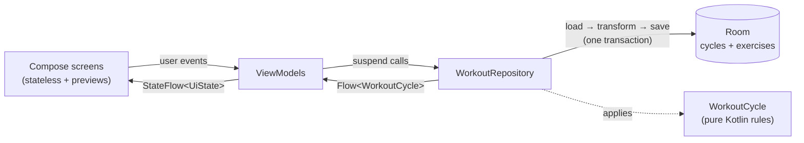

# Workout Cycle

An Android app for running a looping exercise rotation. It shows the current movement with one large **Done** button. Tapping it cues up the next movement, and after the last one it loops back to the first.

Default rotation: **Push-ups → Back stretches → Shoulders → Triceps → Biceps → (repeat)**

Built with Kotlin, Jetpack Compose and Material 3, and tuned for a modern phone like the Galaxy S24+.

## Features

| Screen | What it does |
| --- | --- |
| **Active workout** | Shows the current exercise in large type with a looping **cable-machine animation** of the movement and where to set the pulley. It also shows what's up next and progress through the round (segments, round number, sets done). The Done button sits in thumb reach with a haptic confirm. A snackbar offers **Undo** after each set, and the screen stays awake. |
| **Manage exercises** | Add exercises, switch one off to **skip** it without losing its slot, delete it, or **drag the handle to reorder**. Each exercise has a chip that opens a **picker with live previews** of every cable movement. TalkBack users get *Move up / Move down* actions instead of dragging. |

## Installing on a phone without a computer

Every push that changes `workout-tracker/` runs two GitHub Actions workflows:

- **Workout Cycle APK** runs the unit tests, builds the app and publishes it at
  https://github.com/pavneet-s/pavneet-s/releases/download/workout-cycle-latest/workout-cycle.apk.
  Open that link on the phone to install or update.
- **Workout Cycle smoke test** installs the previous release on an Android emulator and makes
  progress. It then upgrades to the new build and checks that the progress survived, the
  animations show and the picker saves a choice. Screenshots are kept as a run artifact.

Debug builds are signed with the committed `app/debug.keystore`, so cloud and local builds
can update each other without an uninstall, which would wipe saved progress.

## Running it from Android Studio

1. Open the `workout-tracker/` folder in Android Studio. Use a recent version, which bundles JDK 17+.
2. Let Gradle sync. Install SDK Platform 36 if Studio prompts for it.
3. Run the `app` configuration on your phone or an emulator.

Unit tests for the cycle logic run on the JVM with no device:

```bash
./gradlew :app:testDebugUnitTest
```

Dependency versions are pinned in `gradle/libs.versions.toml`. Android Studio's upgrade assistant can bump them.

## Architecture

This is **MVVM with unidirectional data flow** on top of a **pure-Kotlin domain model**, with Room as the single source of truth.



- **UI (Compose):** each screen has a stateful `…Route` that wires up the ViewModel and a stateless `…Screen` that takes plain state and lambdas, so Android Studio can preview it.
- **ViewModels** map the repository's `Flow<WorkoutCycle>` into a screen-specific `UiState`, exposed as a `StateFlow`. They turn taps into repository calls.
- **Repository:** every write loads the current snapshot, applies a `WorkoutCycle` operation and saves the result in one Room transaction. Repeated quick taps can't interleave, and the rules stay out of the database code.
- **Domain (`WorkoutCycle`):** an immutable snapshot with pure functions (`completeSet`, `add`, `remove`, `setActive`, `reorder`, `restart`, `restoreProgress`). It has no Android dependencies, so `WorkoutCycleTest` covers it with fast JVM tests.
- **DI:** a small manual `AppContainer`. Move to Hilt if the app grows beyond a couple of screens.

### Why the state survives anything

The current position is a database row, not memory. If you leave the app mid-workout, the process is killed, or the phone restarts, the next launch opens on the same exercise with the same counters.

## Data model

### Domain

```kotlin
data class Exercise(val id: Long, val name: String, val isActive: Boolean = true)

data class WorkoutCycle(
    val exercises: List<Exercise>,      // list order = rotation order (skipped ones included)
    val currentExerciseId: Long?,       // pointer by ID, never by index
    val setsCompleted: Int,
    val roundsCompleted: Int,
) {
    val activeExercises: List<Exercise> // what you actually cycle through
    val current: Exercise?              // resolved pointer (see below)
    val upNext: Exercise?               // wraps to the first after the last
    val roundPosition: Int              // 1-based position in the round
}
```

How the cyclical list behaves:

- **The pointer is an ID, not an index.** Reordering, skipping or deleting *other* exercises never moves you off the one you're on.
- **The next exercise wraps around.** After the last active exercise comes the first, which counts as one completed round.
- **Skipping or deleting the current exercise cues the one after it**, not the start of the list.
- **Double-tap safety.** The button sends the ID it is showing, and `completeSet(id)` does nothing unless that ID is still current. A second tap that lands before the screen updates is ignored instead of skipping a movement.
- **Undo** restores the pointer and counters from before the last set, leaving the exercise list as is.

### Persistence (Room)

| Table | Columns | Notes |
| --- | --- | --- |
| `cycles` | `id`, `name`, `current_exercise_id`, `sets_completed`, `rounds_completed` | One row today, seeded on first launch. |
| `exercises` | `id`, `cycle_id` → `cycles.id`, `name`, `position`, `is_active`, `animation` | `position` is rewritten on each save. `animation` is `NULL` (guess from the name), `OFF`, or a movement name; added in version 2. |

The repository observes a `@Transaction` query that returns `CycleWithExercises` (`@Embedded` cycle plus a `@Relation` to its exercises). A change to both tables is therefore never seen half-applied. Keying exercises by `cycle_id` also leaves room for several routines later, such as "Push day" and "Pull day".

## Cable machine animations

Each exercise shows a looping stick-figure demo on a cable tower. The weight stack rises as
the handle moves away from the pulley, and there's a short squeeze at the top of each rep.

- **Movements:** chest press, row, straight-arm pulldown, face pull, lateral raise (front
  view), triceps pushdown, overhead triceps extension and curl.
- **Choosing one:** an exercise's animation is guessed from its name. "Push-ups" maps to the
  chest press, "Back" to the row, "Shoulders" to the lateral raise, and so on; see
  `CableMovement.guessFor`. A different movement, or none, can be picked on the manage screen.
  The choice is stored in `exercises.animation`, added by the version 1 to 2 database migration.
- **How it's built:** the poses (`ui/cable/CablePoses.kt`) and drawing (`ui/cable/CableDrawing.kt`)
  are plain Kotlin. They use inverse kinematics for the multi-joint presses and rows, and
  produce lines, circles and boxes in a fixed 100 × 86 scene. `CableMachineAnimation` draws
  those on a Compose `Canvas`, coloured from the Material theme, and redraws in the draw phase
  only. Being plain Kotlin, the geometry is unit-tested on the JVM: limbs keep their length,
  feet stay on the floor, and nothing leaves the frame or passes through the machine.

## Drag and drop

`ManageCycleScreen` uses [Calvin-LL/Reorderable](https://github.com/Calvin-LL/Reorderable) on a `LazyColumn`:

- Rows move in a **local copy** of the list while you drag, so the UI follows your finger without a database round trip.
- The new order is saved **once, on drop**, through `reorder(orderedIds)`, not on every frame.
- The local list re-syncs whenever Room emits, unless a drag is in progress.
- Haptic ticks fire as rows swap. Each row also has *Move up / Move down* accessibility actions for TalkBack and Switch Access.

## Galaxy S24+ touches

- **Edge-to-edge** layout, with the Done button padded above the gesture bar.
- **Material You** colours from the wallpaper (Android 12+), with a fallback palette.
- **Predictive back** (`enableOnBackInvokedCallback`) for the One UI back gesture animation.
- **Haptics** using the Compose `Confirm` / `Segment` feedback types.
- **Screen stays on** during the workout, since the phone is usually on the floor mid-set.

## Project layout

```
app/src/main/java/com/pavneet/workoutcycle/
├── WorkoutCycleApp.kt          Application + AppContainer (manual DI)
├── MainActivity.kt             edge-to-edge, theme, nav host
├── domain/
│   ├── WorkoutCycle.kt         Exercise + WorkoutCycle: all cycle rules
│   └── CableMovement.kt        cable movements, pulley heights, name guessing
├── data/
│   ├── WorkoutRepository.kt    load → transform → save, Flow<WorkoutCycle>
│   └── local/                  Room entities, DAO, database (+ default seed)
└── ui/
    ├── WorkoutNavHost.kt       type-safe Navigation Compose routes
    ├── cable/                  pose engine, drawing and the Compose animation
    ├── theme/Theme.kt
    ├── workout/                Active workout screen + ViewModel
    └── manage/                 Manage exercises screen, animation picker + ViewModel
```

## Ideas for next steps

- A `set_log` table (exercise, timestamp, reps or weight) for history and streaks.
- An optional rest timer between movements, with a notification.
- Several named routines, which the `cycle_id` foreign key already allows.
- A Wear OS tile or Galaxy Watch complication for the Done button.
