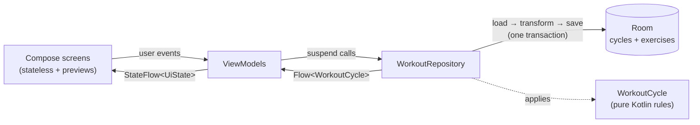

# Workout Cycle

An Android app for running a looping exercise rotation. It shows the current movement with one large **Done** button. Tapping it cues up the next movement, and after the last one it loops back to the first.

Default rotation, by muscle group: **Chest → Back → Shoulders → Triceps → Biceps → (repeat)**. Swipe the animation to pick which cable exercise you're doing for each.

Built with Kotlin, Jetpack Compose and Material 3, and tuned for a modern phone like the Galaxy S24+.

## Features

| Screen | What it does |
| --- | --- |
| **Active workout** | Shows the current muscle group in large type with a looping **cable-machine animation** and where to set the pulley. **Swipe the animation** to switch between the group's cable exercises (chest press, flys, …); the choice is remembered. The figure **talks you through common mistakes** in a speech bubble, a new tip every few seconds (tap for the next), and the **weight stack lights up** to match the weight you've entered. It also shows what's up next and progress through the round. A snackbar offers **Undo** after each set, and the screen stays awake. |
| **Weight and reps** | Steppers above the Done button, **prefilled from the last time you did that cable exercise** ("Last: 35 lb × 12 reps · Monday"), so a fly doesn't inherit your press weight. Tap a value to type it. Units are lb, kg or stack plate number. Done logs the set. |
| **Rest timer** | After Done, a countdown with **+15 s** and **Skip rest** while the next exercise and its pulley height are already on screen. An exact alarm fires a **rest-over alert**, even with the screen off. |
| **Machine setup** | Tap an exercise on the manage screen to rename it and save its **attachment** (rope, handle, bars, ankle strap), **pulley position** and **setup notes**. They show under the animation, e.g. "Rope · Notch 12 · Two steps back". |
| **History** | Day streak, days this week and total sets. A 12-week **training calendar**, a **weight progress chart** per cable exercise ("Chest · Cable fly"), and recent workouts. |
| **Lock screen and Galaxy Watch** | A workout notification shows the current exercise with a **Done** button, or the rest countdown with **Skip rest / +15 s**. Wear OS mirrors phone notifications and their buttons to a paired watch, so a Galaxy Watch can finish a set without a watch app. |
| **Muscle groups** | Add muscle groups, switch one off to **skip** it without losing its slot, delete it, or **drag the handle to reorder**. Each has a chip that opens a **picker with live previews** of every cable exercise, grouped by muscle. TalkBack users get *Move up / Move down* actions instead of dragging. |
| **Haptics** | Every kind of button has its own feel: a double thump for Done, rising and falling ticks for weight +/−, a crisp or soft tick for reps, a double tap to skip a rest, triple ticks for +15 s and more (`ui/Haptics.kt`). They use the motor's vibration primitives where supported and follow the phone's touch-vibration setting. |

## Installing on a phone without a computer

Every push that changes `workout-tracker/` runs the **Workout Cycle APK** GitHub Actions
workflow in three stages:

1. **Build:** runs the unit tests and builds the APK.
2. **Emulator test:** installs the previous release on an Android emulator and makes progress.
   It then upgrades to the new APK in place and checks the progress survived, the animations
   show and the picker saves a choice (`scripts/smoke-test.sh`). Screenshots are kept as a run
   artifact.
3. **Publish:** only if both pass, replaces the APK at
   https://github.com/pavneet-s/pavneet-s/releases/download/workout-cycle-latest/workout-cycle.apk.
   Open that link on the phone to install or update.

Debug builds are signed with the committed `app/debug.keystore`, so cloud and local builds
can update each other without an uninstall, which would wipe saved progress.

## Running it from Android Studio

1. Open the `workout-tracker/` folder in Android Studio. Use a recent version, which bundles JDK 17+.
2. Let Gradle sync. Install SDK Platform 36 if Studio prompts for it.
3. Run the `app` configuration on your phone or an emulator.

Unit tests for the cycle logic run on the JVM with no device:

```bash
./gradlew :app:testDebugUnitTest
```

Dependency versions are pinned in `gradle/libs.versions.toml`. Android Studio's upgrade assistant can bump them.

## Architecture

This is **MVVM with unidirectional data flow** on top of a **pure-Kotlin domain model**, with Room as the single source of truth.



- **UI (Compose):** each screen has a stateful `…Route` that wires up the ViewModel and a stateless `…Screen` that takes plain state and lambdas, so Android Studio can preview it.
- **ViewModels** map the repository's `Flow<WorkoutCycle>` into a screen-specific `UiState`, exposed as a `StateFlow`. They turn taps into repository calls.
- **Repository:** every write loads the current snapshot, applies a `WorkoutCycle` operation and saves the result in one Room transaction. Repeated quick taps can't interleave, and the rules stay out of the database code.
- **Domain (`WorkoutCycle`):** an immutable snapshot with pure functions (`completeSet`, `add`, `remove`, `setActive`, `reorder`, `restart`, `restoreProgress`). It has no Android dependencies, so `WorkoutCycleTest` covers it with fast JVM tests.
- **DI:** a small manual `AppContainer`. Move to Hilt if the app grows beyond a couple of screens.

### Why the state survives anything

The current position is a database row, not memory. If you leave the app mid-workout, the process is killed, or the phone restarts, the next launch opens on the same exercise with the same counters.

## Data model

### Domain

```kotlin
data class Exercise(val id: Long, val name: String, val isActive: Boolean = true)

data class WorkoutCycle(
    val exercises: List<Exercise>,      // list order = rotation order (skipped ones included)
    val currentExerciseId: Long?,       // pointer by ID, never by index
    val setsCompleted: Int,
    val roundsCompleted: Int,
) {
    val activeExercises: List<Exercise> // what you actually cycle through
    val current: Exercise?              // resolved pointer (see below)
    val upNext: Exercise?               // wraps to the first after the last
    val roundPosition: Int              // 1-based position in the round
}
```

How the cyclical list behaves:

- **The pointer is an ID, not an index.** Reordering, skipping or deleting *other* exercises never moves you off the one you're on.
- **The next exercise wraps around.** After the last active exercise comes the first, which counts as one completed round.
- **Skipping or deleting the current exercise cues the one after it**, not the start of the list.
- **Double-tap safety.** The button sends the ID it is showing, and `completeSet(id)` does nothing unless that ID is still current. A second tap that lands before the screen updates is ignored instead of skipping a movement.
- **Undo** restores the pointer and counters from before the last set, leaving the exercise list as is.

### Persistence (Room)

| Table | Columns | Notes |
| --- | --- | --- |
| `cycles` | `id`, `name`, `current_exercise_id`, `sets_completed`, `rounds_completed` | One row today, seeded on first launch. |
| `exercises` | `id`, `cycle_id` → `cycles.id`, `name`, `position`, `is_active`, `animation`, `attachment`, `pulley_position`, `setup_note` | `position` is rewritten on each save. `animation` is `NULL` (guess from the name), `OFF`, or a movement name; added in version 2. The setup columns were added in version 3. |
| `set_logs` | `id`, `exercise_id` → `exercises.id` (set to `NULL` on delete), `exercise_name`, `weight`, `weight_unit`, `reps`, `completed_at`, `movement` | One row per completed set. The name is copied in so history survives renames and deletes. Version 3; `movement` (which cable exercise of the muscle group) was added in version 4. |
| `settings` | `rest_enabled`, `rest_seconds`, `weight_unit`, `workout_notification`, `notification_prompted` | A single row, missing until something is changed; the defaults live in `AppSettings`. Version 3. |

`cycles` also gained `rest_ends_at` in version 3. Version 4 credits older sets to the cable
exercise their slot was showing and renames the old defaults "Push-ups" and "Back stretches"
to "Chest" and "Back". Each version bump has a hand-written migration in `WorkoutDatabase`,
and the emulator job upgrades from real older releases to prove them.

The repository observes a `@Transaction` query that returns `CycleWithExercises` (`@Embedded` cycle plus a `@Relation` to its exercises). A change to both tables is therefore never seen half-applied. Keying exercises by `cycle_id` also leaves room for several routines later, such as "Push day" and "Pull day".

## Cable machine animations

Each muscle group shows a looping stick-figure demo on a cable tower. The pinned plates of
the weight stack (one per 10 lb or 5 kg, plus a half-plate add-on, or the pin number in
"Plate" mode) light up and rise as the handle moves away from the pulley, and there's a short
squeeze at the top of each rep.

- **Exercises, by muscle group:** chest (press, single-arm fly, high-to-low fly, low-to-high
  fly), back (row, kneeling lat pulldown, straight-arm pulldown), shoulders (lateral raise,
  front raise, face pull), triceps (pushdown, overhead extension, kickback), biceps (curl,
  high cable curl, behind-the-back curl), legs (glute kickback, pull-through) and core
  (kneeling crunch, woodchopper). Flys, the lateral raise, the high curl and the woodchopper
  are drawn from the front; the rest from the side.
- **Choosing one:** swipe the animation on the workout screen, or use the picker on the manage
  screen. Until then it's guessed from the name: "Chest" starts on the chest press, "Back" on
  the row and so on (`CableMovement.guessFor`). The choice is stored in `exercises.animation`.
- **Form tips:** each exercise has five common mistakes (`res/values/tips.xml`) that the
  figure says in a speech bubble above its head, one every six seconds.
- **How it's built:** the poses (`ui/cable/CablePoses.kt`) and drawing (`ui/cable/CableDrawing.kt`)
  are plain Kotlin. They use inverse kinematics for the multi-joint presses and rows, and
  produce lines, circles and boxes in a fixed 100 × 86 scene. `CableMachineAnimation` draws
  those on a Compose `Canvas`, coloured from the Material theme, and redraws in the draw phase
  only. Being plain Kotlin, the geometry is unit-tested on the JVM: limbs keep their length,
  feet stay on the floor, and nothing leaves the frame or passes through the machine.

## Rest timer, notifications and the watch

`session/WorkoutController` is the one place a set gets completed, whether from the app's Done
button, the notification's Done button (on the phone or a paired watch) or the rest alarm:

- **Completing a set** logs it, advances the cycle and starts a rest of `settings.rest_seconds`.
  This happens in one transaction, in `WorkoutRepository.completeSet`. The notification and
  watch path pass no weight or reps, so they repeat the exercise's last values.
- **The rest alarm** is an exact `AlarmManager` alarm (`USE_EXACT_ALARM`, granted at install on
  Android 13+). It lets `RestAlarmReceiver` end the rest and post a high-priority "Rest over"
  alert that vibrates the phone and the watch.
- **The workout notification** is rebuilt by `WorkoutNotificationSync` whenever the cycle,
  settings or last sets change. It is deliberately *not* ongoing, because Wear OS doesn't
  mirror ongoing notifications. It disappears an hour after the last activity
  (`setTimeoutAfter`).
- **Without notification permission** the rest still counts down in the app, which buzzes when it
  ends while the screen is up.

## Drag and drop

`ManageCycleScreen` uses [Calvin-LL/Reorderable](https://github.com/Calvin-LL/Reorderable) on a `LazyColumn`:

- Rows move in a **local copy** of the list while you drag, so the UI follows your finger without a database round trip.
- The new order is saved **once, on drop**, through `reorder(orderedIds)`, not on every frame.
- The local list re-syncs whenever Room emits, unless a drag is in progress.
- Haptic ticks fire as rows swap. Each row also has *Move up / Move down* accessibility actions for TalkBack and Switch Access.

## Galaxy S24+ touches

- **Edge-to-edge** layout, with the Done button padded above the gesture bar.
- **Material You** colours from the wallpaper (Android 12+), with a fallback palette.
- **Predictive back** (`enableOnBackInvokedCallback`) for the One UI back gesture animation.
- **Haptics** with a distinct pattern per button (see the Haptics row above).
- **Screen stays on** during the workout, since the phone is usually on the floor mid-set.

## Project layout

```
app/src/main/java/com/pavneet/workoutcycle/
├── WorkoutCycleApp.kt          Application + AppContainer (manual DI)
├── MainActivity.kt             edge-to-edge, theme, nav host
├── domain/
│   ├── WorkoutCycle.kt         Exercise + WorkoutCycle: all cycle rules, rest state
│   ├── Training.kt             weights, sets, machine setup, settings
│   ├── WorkoutHistory.kt       streaks, sessions and progress from the set log
│   └── CableMovement.kt        muscle groups, cable exercises, pulley heights, name guessing
├── session/                    WorkoutController, rest alarm, notifications (watch Done)
├── data/
│   ├── WorkoutRepository.kt    load → transform → save, Flow<WorkoutCycle>
│   └── local/                  Room entities, DAO, database (+ default seed)
└── ui/
    ├── WorkoutNavHost.kt       type-safe Navigation Compose routes
    ├── Haptics.kt              a vibration pattern for each kind of button
    ├── cable/                  pose engine, drawing, the Compose animation, labels and tips
    ├── theme/Theme.kt
    ├── workout/                Active workout screen, exercise pager with the tip bubble, ViewModel
    ├── manage/                 Muscle groups, editor, cable exercise picker
    ├── history/                History screen, training calendar, progress charts
    └── settings/               Settings screen
```

## Ideas for next steps

- Several named routines, which the `cycle_id` foreign key already allows.
- A session goal (e.g. three rounds) with a summary at the end.
- Export or backup of the set log.
- A dedicated Wear OS app or tile. It needs a computer to install on the watch, unlike the
  notification-based Done button.
